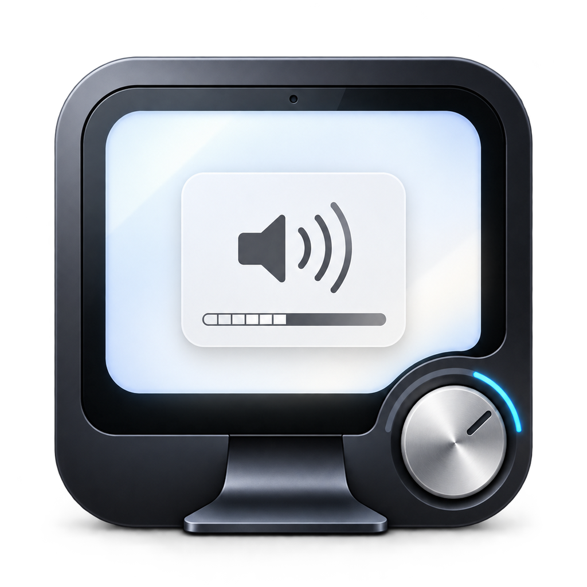
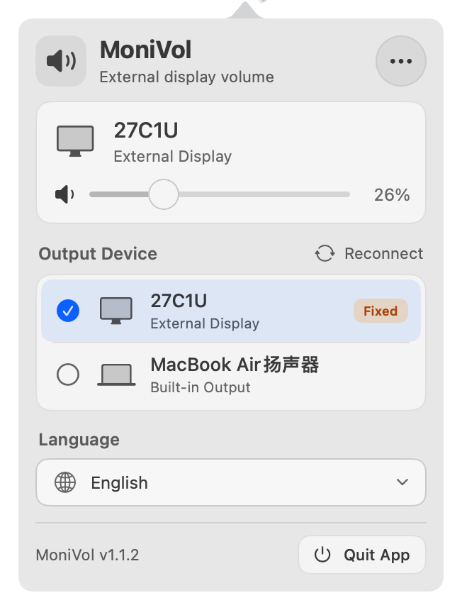
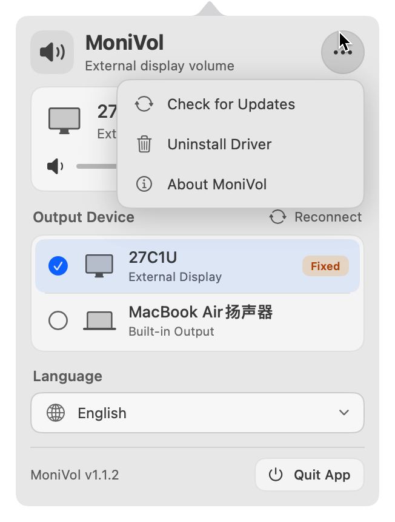

# MoniVol

English | [简体中文](README.zh-CN.md)

<p align="center">
  
</p>

**MoniVol is a free, simple, lightweight macOS menu bar app that enables system volume control for external HDMI and DisplayPort displays.**

Use your Mac's volume keys, mute key, and system volume slider with a connected display. MoniVol focuses on this one task: it does not include an EQ, per-app volume controls, audio effects, or complex routing.

|  |  |
| :---: | :---: |

## Features

- **System volume control**: Adds software volume and mute control for HDMI and DisplayPort displays that lack it.
- **Menu bar controls**: Adjust volume, mute, switch output devices, and check for updates.
- **Native SwiftUI interface**: A modern, uncluttered menu bar layout.
- **Small footprint**: The current DMG is under 5 MB, and MoniVol uses less than 30 MB of memory in the author's everyday setup.
- **Automatic display handling**: Switches to built-in output when a display disconnects, then restores the corresponding MoniVol output when it reconnects.
- **Selective proxying**: Built-in speakers, Bluetooth headphones, and ordinary USB audio devices continue to use native macOS output.
- **Apple Silicon and Intel**: Universal app for macOS 13 Ventura or later.

## Why MoniVol?

macOS does not offer software volume control for some HDMI and DisplayPort audio outputs. If the display also cannot be controlled through DDC, the Mac's volume keys cannot adjust its sound.

SoundSource, eqMac, and FineTune cover broader audio needs, including EQ, per-app volume, and routing. MoniVol focuses on making system volume control work for external displays while leaving other output devices on their native audio paths.

In the author's everyday setup, SoundSource has reached about 400–500 MB of memory after extended use, while MoniVol stays under 30 MB. Memory use varies with macOS version, connected devices, and uptime.

## Install

The repository is currently private. If you have access, download the latest `MoniVol.dmg` from [GitHub Releases](https://github.com/Geliv/MoniVol/releases/latest):

1. Open the DMG and drag `MoniVol.app` into Applications.
2. Launch MoniVol and follow the first-run guide to install the audio driver. This step requires an administrator password.
3. In macOS Sound settings, select the display's corresponding `(MoniVol)` output device.

MoniVol is not Developer ID signed or notarized by Apple. If macOS blocks the first launch, go to **System Settings → Privacy & Security** and choose **Open Anyway**, or remove the app's quarantine attribute in Terminal:

```bash
xattr -rd com.apple.quarantine /Applications/MoniVol.app
```

You can then use the system volume keys, mute key, and volume slider. A Homebrew installation method is not available.

## Uninstall

1. Open MoniVol from the menu bar and select **Uninstall Driver**.
2. Quit MoniVol. It also quits automatically after the driver is removed.
3. Move `MoniVol.app` from Applications to the Trash.

## How It Works

For an HDMI or DisplayPort output without writable volume controls, MoniVol creates a corresponding virtual audio device:

```text
macOS / apps
    ↓
MoniVol virtual output
    ↓
Software volume and mute
    ↓
Physical HDMI / DisplayPort display
```

System volume controls act on the virtual device. MoniVol Host adjusts the audio gain and forwards playback to the physical display. Other output devices do not use this path.

## Build from Source

You need macOS 13 or later, Xcode Command Line Tools, Swift 5.9 or later, CMake 3.20 or later, and Git. Install the command line tools and CMake:

```bash
xcode-select --install
brew install cmake
```

Clone the repository with the libASPL submodule required by the HAL driver, then build:

```bash
git clone --recurse-submodules https://github.com/Geliv/MoniVol.git
cd MoniVol
./tools/build_release.sh
```

If you already cloned the repository without submodules, run `git submodule update --init --recursive` first.

The universal app, audio Host, and HAL driver are bundled in `dist/MoniVol.app`. Open it directly, or copy it to Applications:

```bash
sudo ditto dist/MoniVol.app /Applications/MoniVol.app
open /Applications/MoniVol.app
```

The project does not provide Developer ID signing. GitHub Release and local source builds are not notarized by Apple.

## Credits

MoniVol's early implementation drew on [SoundBridge](https://github.com/chenjy16/SoundBridge) for its virtual audio device and Host forwarding architecture. The HAL driver uses [libASPL](https://github.com/gavv/libASPL).

## License

License information is pending.
