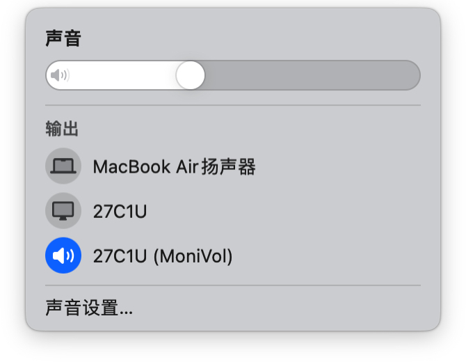
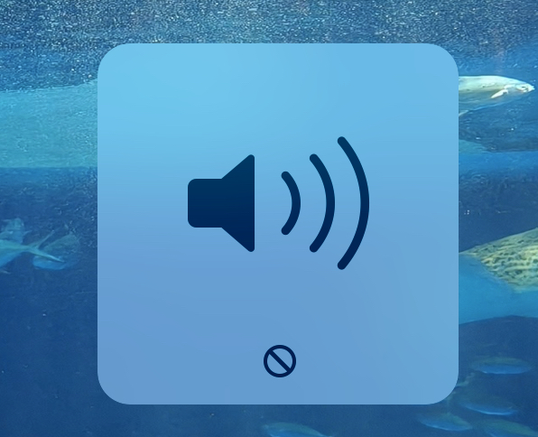
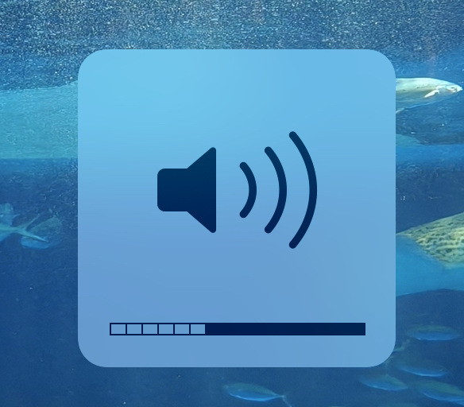
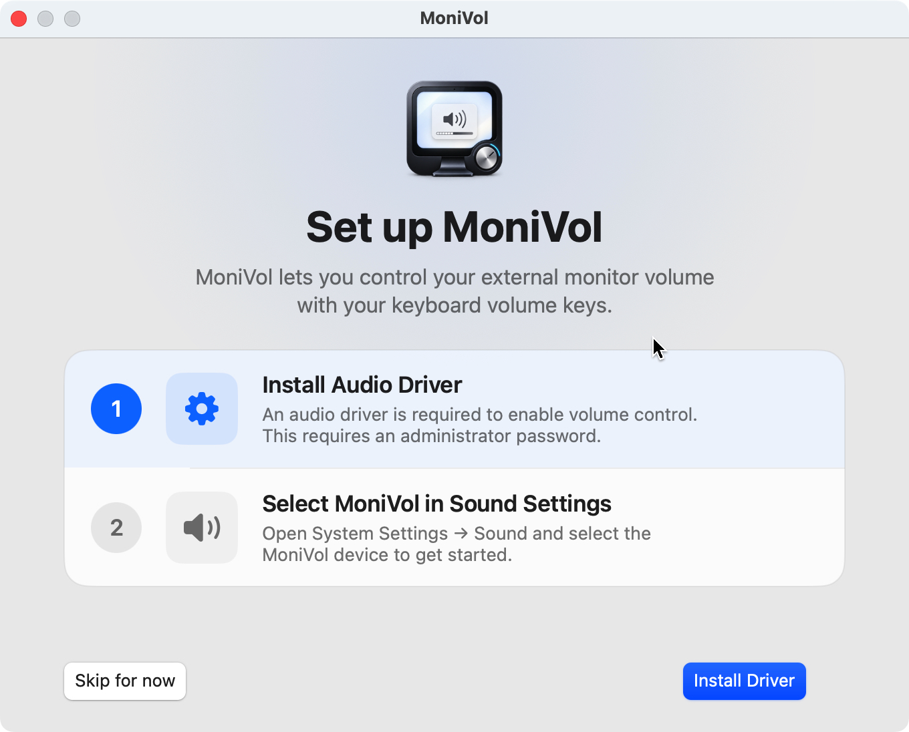

# MoniVol

[English](README.md) | 简体中文

<p align="center">
  
</p>

**MoniVol 是一款免费、简单、轻量的 macOS 菜单栏应用，专门解决部分 HDMI／DisplayPort 外接显示器无法使用系统音量控制的问题。**

连接显示器后，可以使用 Mac 键盘音量键、静音键和系统音量滑块调节声音。MoniVol 不提供 EQ、分应用音量、音效插件或复杂的音频路由，只专注于外接显示器音量控制。

|  |  |
| :---: | :---: |
| *菜单栏弹窗* | *控制中心输出列表* |
|  |  |
| *使用前：外接显示器音量不可调节* | *使用后：音量正常调节* |

## 功能

- **系统音量控制**：为原本无法调节音量的 HDMI／DisplayPort 显示器提供软件音量和静音控制。
- **菜单栏操作**：调节音量、静音和切换输出设备，也可手动检查更新。
- **原生 SwiftUI 界面**：采用现代、简洁的菜单栏布局。
- **轻量运行与安装**：发布版 DMG 安装包约 5 MB；在作者的日常使用环境中，常驻内存占用约 30 MB。
- **自动处理插拔**：显示器断开后移除对应的虚拟设备并切回内建输出；同一显示器重新连接后自动恢复对应的 MoniVol 输出。
- **只代理需要处理的显示器**：内建扬声器、蓝牙耳机和普通 USB 音频设备继续使用 macOS 原生输出。

## 为什么是 MoniVol？

macOS 对部分 HDMI／DisplayPort 音频设备没有提供软件音量控制；如果显示器也无法通过 DDC 控制硬件音量，键盘音量键就不能调节它的声音。

SoundSource、eqMac、FineTune 等应用覆盖更广的音频控制需求，例如 EQ、分应用音量和路由。MoniVol 专注于一个场景：让外接显示器的系统音量控制可用，同时保持其他输出设备的原生行为。它没有这些额外的音频处理功能，常驻逻辑也更精简。

在作者的日常使用环境中，SoundSource 长时间运行后的内存占用曾达到约 400–500 MB，MoniVol 则约为 30 MB。内存占用会随系统版本、连接设备和运行时间变化。

## 安装

从 [GitHub Releases](https://github.com/Geliv/MoniVol/releases/latest) 下载最新的 `MoniVol.dmg`：

1. 打开 DMG，将 `MoniVol.app` 拖入“应用程序”目录。
2. 启动 MoniVol，按首次运行引导安装音频驱动；此步骤需要管理员密码。
3. 在 MoniVol 菜单栏的输出设备列表中选择显示器，或在系统声音输出列表中选择对应的 `（MoniVol）` 设备。

<p align="center">
  
</p>
<p align="center"><em>首次运行引导</em></p>

也可以通过 [MoniVol Homebrew tap](https://github.com/Geliv/homebrew-tap) 安装应用：

```bash
brew install --cask Geliv/tap/monivol
```

安装后启动 MoniVol，按上面的第 2–3 步完成设置。

如需登录后自动启动，在菜单栏弹窗中打开“更多选项 → 登录时打开”并勾选。

从 v1.1.5 起，“更多选项 → 检查更新”可在应用内下载并安装更新。旧版本需要先手动升级到 v1.1.5 或更新版本。

如果 macOS 阻止首次打开手动安装、未经公证的版本，可前往“系统设置 → 隐私与安全性”选择“仍要打开”，或在终端移除应用的隔离属性：

```bash
xattr -rd com.apple.quarantine /Applications/MoniVol.app
```

之后即可使用系统音量键、静音键和音量滑块。

## 卸载

1. 在菜单栏打开 MoniVol，选择“Uninstall Driver”并完成驱动卸载。
2. 退出 MoniVol；卸载驱动后应用也会自动退出。
3. 将“应用程序”目录中的 `MoniVol.app` 移入废纸篓。如果通过 Homebrew 安装，改为运行 `brew uninstall --cask Geliv/tap/monivol`。

## 工作原理

对于缺少可写音量控制的 HDMI／DisplayPort 输出，MoniVol 会创建对应的虚拟音频设备：

```text
macOS / 应用
    ↓
MoniVol 虚拟输出
    ↓
软件音量与静音处理
    ↓
实际 HDMI／DisplayPort 显示器
```

系统音量控制作用在虚拟设备上，MoniVol Host 根据音量值调整音频增益，再将声音送往实际显示器。其他输出设备不经过这条链路。

## 从源码构建

需要 macOS 13 或更新版本、Xcode Command Line Tools、Swift 5.9 或更新版本、CMake 3.20 或更新版本，以及 Git。安装命令行工具和 CMake：

```bash
xcode-select --install
brew install cmake
```

克隆仓库时一并获取 HAL 驱动依赖的 libASPL 子模块，然后构建：

```bash
git clone --recurse-submodules https://github.com/Geliv/MoniVol.git
cd MoniVol
./tools/build_release.sh
```

如果已经克隆仓库但没有初始化子模块，先运行 `git submodule update --init --recursive`。

构建产物位于 `dist/MoniVol.app`，包含双架构的菜单栏应用、音频 Host 和 HAL 虚拟驱动。可以运行 `open dist/MoniVol.app`，或复制到“应用程序”目录：

```bash
sudo ditto dist/MoniVol.app /Applications/MoniVol.app
open /Applications/MoniVol.app
```

## 致谢

MoniVol 的早期实现参考了 [SoundBridge](https://github.com/chenjy16/SoundBridge) 的虚拟音频设备与 Host 转发架构；HAL 驱动使用 [libASPL](https://github.com/gavv/libASPL)。

## License

MoniVol 采用 [PolyForm Noncommercial License 1.0.0](LICENSE) 许可证。个人、学习和教育等非商业用途可免费使用；商业用途需事先获得作者授权。
